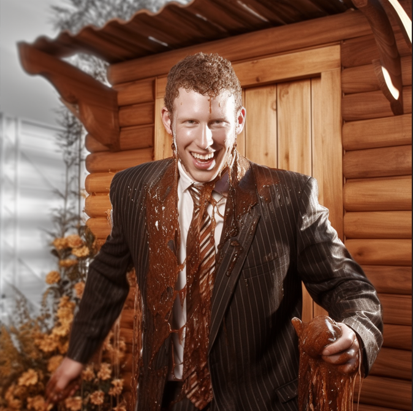
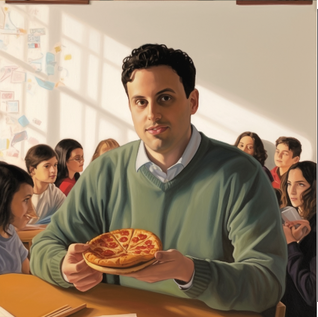
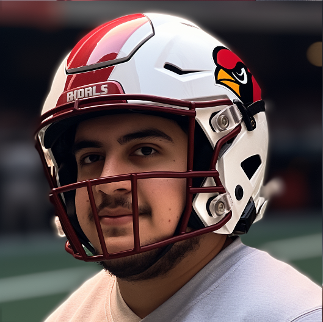

# LAIC Week 6 Rankings

Week 6 rankings were done be me (Max). 

Had some fun with these.

## Rankings

### 1. JKauff in Ya Maufff (6-0)

_**"BYRAM HILLS TENNIS STAR BREAKS DOWN CRYING MID-MATCH AFTER HIS UNDEFEATED FANTASY TEAM LOSES IN THE FINALS"**_

_Quick Thoughts_: I cant knock the teams performance, but I have no confidence in the historical laughing stock of the league reaching the finish line. 

### 2. Donnie Wahlberg (5-1)

_**"STRANGE MAN NEARLY SUFFOCATES AFTER SUPPOSED FRIEND CONVINCES HIM TO DIG FOR EARTHWORMS?"**_

_Quick Thoughts_: This team's roster is honestly terrible but so is Jalen Hurts so maybe he can smush his butt into the endzone this year like the Eagles. 

### 3. Hickory Crawdads (3-3)

_**"TRACES OF URINE AND OTHER BODILY FLUIDS FOUND ON LARGE MAN AFTER LEAVING HIS OUTDOOR SHOWER"**_

_Quick Thoughts_: Huge performance this week from a huge man. Travis Kelce is taking over the NFL and your team. 

### 4. Mac Jones Rayman (3-3) 

_**"FBI'S MOST WANTED CYBER-HACKER SLIPPED UP AFTER PLAYING TOO MANY VIDEO GAMES"**_

_Quick Thoughts_: I have the best team in the league. Look at it.

### 5. Lancaster Barnstormers (3-3)

_**"ATLANTA BAR EVACUATED AFTER FLATULENCE ERUPTION FROM A MYSTERIOUS FIGURE"**_

_Quick Thoughts_: Very underrated team just like mine. Flying under the radar and if his players are consistently good playoff time the league is screwed. 

### 6. The Junkyard Salami Branches (3-3)

_**"LOCAL JACKED EMPLOYEE OF THE KNICKS SHOWS UP AS TOM THIBODEAUS SURPRISE 12TH MAN"**_

_Quick Thoughts_: You need a RB2 on your team to really have a chance to make a run.

### 7. Yuddies and Tuddies (3-3)

_**"OUTGOING, CHARISMATIC, CHIVALROUS, AND HANDSOME MAN - SECRETLY A GAMER?"**_

_Quick Thoughts_: The Minnesota Dean's have a lot of duplicate team players, which means he can win or lose any week depending on how they do. 

### 8. Who's Peat Weba?

_**"MAN CAUGHT TRYING TO SPEND AMEX REWARDS POINTS ON FANTASY FOOTBALL FREE AGENCY"**_

_Quick Thoughts_: We thought the worst of the team I drafted for you at the start of the season but things are turning around. Unfortunately week 7 seems unwinnable so prepare to be ranked lower next week before the comeback. 

### 9. The Booch (3-3)

_**"OVERSIZED, OVER-AGED ITALIAN GUIDO SENTENCED TO 2 WEEKS IN JUVIE FOR DEALING DRUGS TO HIGH SCHOOLERS"**_

_Quick Thoughts_: I do not think your QB abundance has aged well. Good luck with that. 

### 10. Punta Gorda Floridiots (2-4) 

_**"FLORIDA MAN WRESTLES ALLIGATOR TO THE DEATH AFTER ZAY JONES TOUCHDOWN GETS CALLED BACK"**_

_Quick Thoughts_: AJ Brown is turning into a freak. You have a high point scoring total so things can easily turn around for you. 

### 11. Bijan Mustardson (1-5)

_**"UTAH MAN SNEAKS INTO ARIZONA CARDINALS ROOM AND IS CAUGHT SNIFFING CLOTHES FROM KYLER MURRAYS LOCKER"**_

_Quick Thoughts_: First win is huge. Literally 2 games behind THIRD PLACE. Dont give up, you can easily win this entire league (your team sucks lol). 

### 12. Team Fish (1-5)

_**"TRAIN CONDUCTOR ARRESTED AFTER BEGGING HIS FEMALE PASSENGERS FOR A 'SPIT-TUG'"**_

_Quick Thoughts_: Your team on paper is not the worst, but holy shit they are playing like it. 

